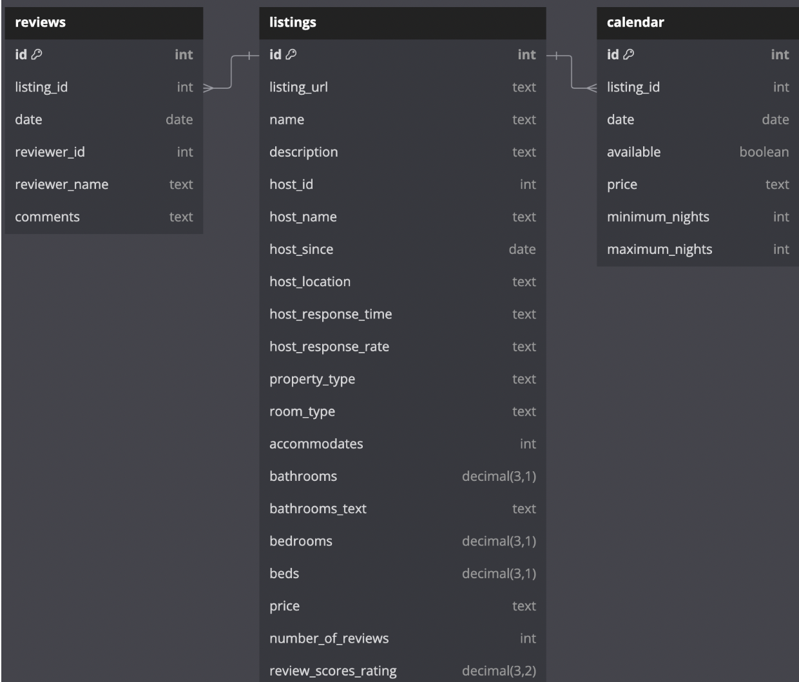

# Airbnb Data Analytics Case Study

## Background
Airbnb is a global vacation rental platform connecting property owners (hosts) with travelers seeking accommodations. The platform features millions of listings, from budget-friendly apartments to luxurious villas. To maintain a competitive edge, Airbnb leverages data analytics to:

- Enhance user experiences.
- Optimize pricing strategies.
- Improve host and guest satisfaction.

The Airbnb analytics team plays a pivotal role in delivering insights into key performance areas, such as host activity, booking trends, and guest feedback. By extracting actionable insights from data, the team aims to optimize revenue, enhance guest experiences, and identify areas for growth.

---

## Goal of the Case Study
The objective of this analysis is to explore Airbnb datasets to uncover insights into:

1. **Booking trends and occupancy rates.**
2. **Host performance and listing popularity.**
3. **Guest feedback and property diversity.**

This study serves as a comprehensive example of how data-driven decisions can enhance operations in the vacation rental industry.

---

## Dataset Schema

The analysis leverages three key datasets: **Listings**, **Calendar**, and **Reviews**.

### 1. Listings Table
Contains detailed information about properties listed on Airbnb:

| Column                | Description                                      |
|-----------------------|--------------------------------------------------|
| `id`                  | Unique identifier for the listing.              |
| `name`                | Title of the listing.                           |
| `description`         | Detailed property description.                  |
| `host_id`             | Identifier for the host managing the property.  |
| `host_name`           | Name of the host.                               |
| `property_type`       | Type of property (e.g., house, apartment).       |
| `room_type`           | Type of room (e.g., entire home, private room). |
| `accommodates`        | Maximum number of guests.                       |
| `price`               | Price per night.                                |
| `review_scores_rating`| Average guest rating.                           |
| `number_of_reviews`   | Total number of reviews.                        |

### 2. Calendar Table
Captures booking and availability data:

| Column      | Description                                        |
|-------------|----------------------------------------------------|
| `listing_id`| Foreign key linking to the `id` column in Listings.|
| `date`      | Specific date for the entry.                       |
| `available` | Indicates if the listing is available (`t`/`f`).   |
| `price`     | Nightly price for the listing.                     |

### 3. Reviews Table
Records guest feedback:

| Column        | Description                                        |
|---------------|----------------------------------------------------|
| `listing_id`  | Foreign key linking to the `id` column in Listings.|
| `id`          | Unique identifier for each review.                |
| `date`        | Date the review was posted.                       |
| `reviewer_id` | Identifier for the reviewer.                      |
| `reviewer_name`| Name of the reviewer.                            |
| `comments`    | Text of the guest's feedback.                     |

---

### Dataset relations

## Key Features of the Repository
- **Exploratory Data Analysis (EDA):**
  - Analyzing booking patterns, seasonal trends, and occupancy rates.
  - Identifying top-performing hosts and popular property types.
  - Investigating guest reviews to derive feedback themes.

- **Actionable Insights:**
  - Recommendations for optimizing pricing strategies.
  - Suggestions to improve guest satisfaction and host engagement.

---

## Results and Recommendations
Key findings and recommendations from the analysis are documented in the **results** file, including:

- Trends in booking and revenue growth.
- Strategies for improving occupancy during off-peak seasons.
- Insights into guest feedback to prioritize host improvements.

---

## Contact
For questions or collaborations, contact Rahul Ganesh Regalla at rahul.g.regalla@gmail.com

